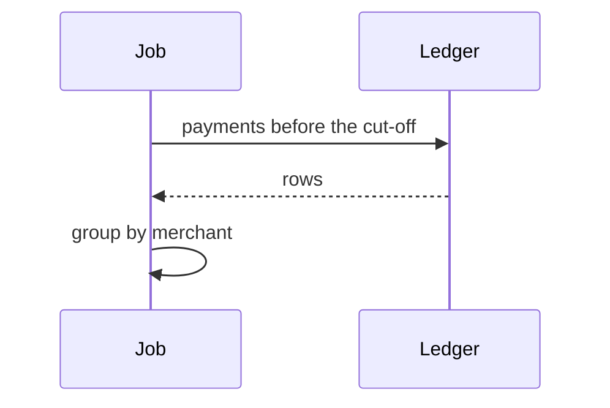

# Settlement design

Settlement runs once a day. It is a pure function of the ledger, so running it twice gives the same report.

```mermaid
sequenceDiagram
  participant Job
  participant Ledger
  Job->>Ledger: payments before the cut-off
  Ledger-->>Job: rows
  Job->>Job: group by merchant
```

See [the README](../README.md) for how to run it.
